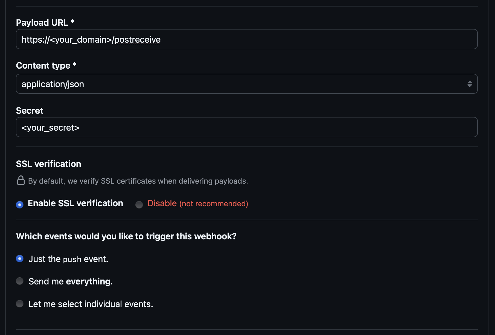

Autodeploy listens for GitHub webhooks and deploys Docker Compose or systemd services running on the same host.

## Usage

Since Autodeploy needs to run commands for other repositories on the host, it must run without Docker. This means you need to install Go and preferrebly run Autodeploy as a systemd service.

### 1. Generate a webhook secret and get a GitHub PAT

First, generate a secret:

```bash
$ openssl rand -hex 32 # use this for webhook_secret
```

Then, create a GitHub [personal access token](https://github.com/settings/tokens) with the `repo` scope. This will be `github_token`.

### 2. Create a `config.yaml` file

This is where you define the repositories and their deployment commands. You need to create a `config.yaml` (preferably at the repository root). Here's an example:

```yaml
webhook_secret: your-webhook-secret
webhook_url_suffix: /postreceive
github_token: your-github-token

services:
  service1:
    repo: "https://github.com/example/repo1"
    path: "/path/to/service1"
    systemd_service: "service1"
    healthcheck_url: "http://localhost:8080/health"
    compose_service: false
    build_command: "make build"

  service2:
    repo: "https://github.com/example/repo2"
    path: "/path/to/service2"
    systemd_service: "service2"
    healthcheck_url: "http://localhost:9090/health"
    compose_service: false
    build_command: "go build ./..."

  service3:
    repo: "https://github.com/example/repo3"
    path: "/path/to/service3"
    healthcheck_url: "http://localhost:3000/health"
    compose_service: true
```

### 3. Create an `autodeploy.env` file

This is where you define the environment variables for Autodeploy. You need to create an `autodeploy.env` file (preferably at the repository root). Here's an example:

```bash
AUTODEPLOY_CONFIG_PATH=/path/to/config.yaml
# optional
AUTODEPLOY_SLACK_CHANNEL=<optional>
AUTODEPLOY_SLACK_TOKEN=<optional>
```

### 4. Build the binary

```bash
$ pwd
/path/to/autodeploy
$ make autodeploy
```

### 5. Set up the systemd service

Create `/etc/systemd/system/autodeploy.service` and add the following:

```ini
[Unit]
Description=Autodeploy
After=network.target

[Service]
User=<your user>
WorkingDirectory=<your path>
ExecStart=<your path>/autodeploy --port 8090
EnvironmentFile=<your path>/autodeploy.env
ExecReload=/bin/kill -s HUP $MAINPID
ExecStop=/bin/kill -s TERM $MAINPID
Restart=on-failure
RestartSec=10

[Install]
WantedBy=multi-user.target
```

Now, start the service:

```bash
$ sudo systemctl daemon-reload
$ sudo systemctl enable autodeploy
$ sudo systemctl start autodeploy
$ sudo systemctl status autodeploy
```

### 6. Serve autodeploy behind a reverse proxy

Use Cloudflare tunnels or something like Caddy to serve Autodeploy behind a reverse proxy. This will be what the GitHub webhook calls.

### 7. Set up the GitHub webhook

Go to your repository settings, select `Webhooks` -> `Add webhook`. Set the fields as follows:



Save the webhook.

### 8. Test it

Now, you should be able to push to your repository and view the logs in the systemd service:

```bash
$ sudo journalctl -xeu autodeploy.service -f
```

## Caveats

#### 1. Must use HTTPS origin
Due to how much easier it is to work with GitHub API's over HTTPS rather than SSH, Autodeploy will add a new origin to your repository, called `autodeploy`.

#### 2. Deploy will fail if not on latest commit before push

Autodeploy will verify that the existing HEAD of the repository that is getting deployed is equal to the `BeforeSha` of the push event.
This could be changed in the future to allow for more flexibility.

#### 3. Only supports push events

The GitHub libraries in this project support nearly all events, but only push events are what I need.

#### 4. `config.yaml` is dangerous

Not only will sensitive tokens be in this file, but they also define arbitrary commands to be run on the host. Keep it secure!